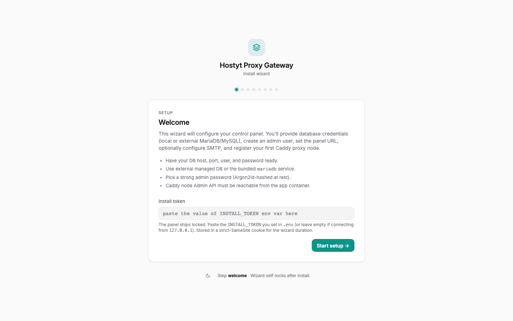
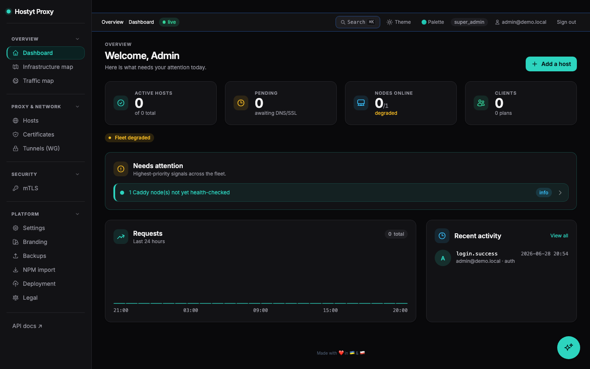
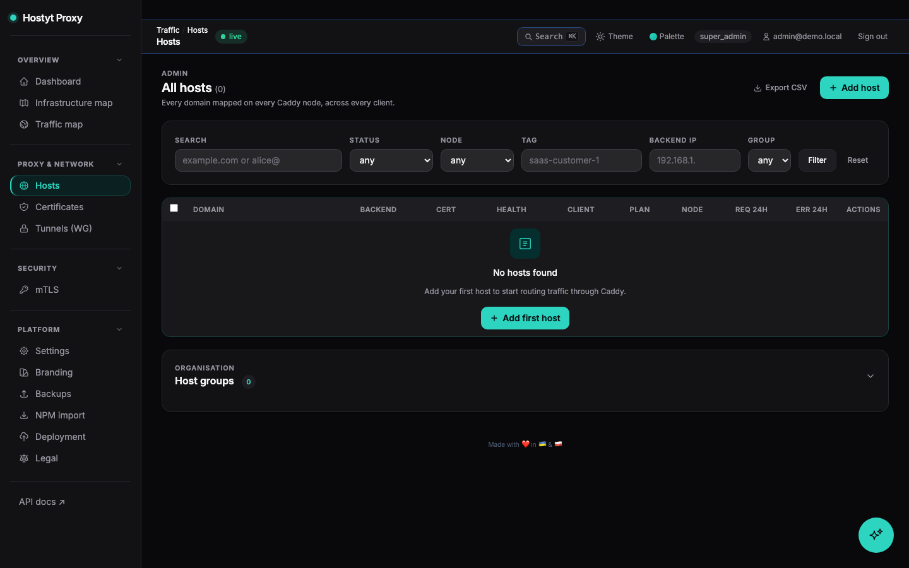
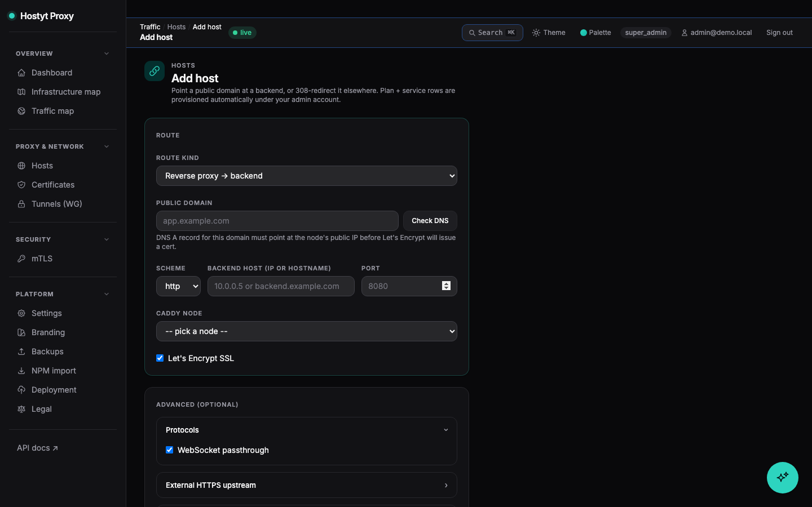
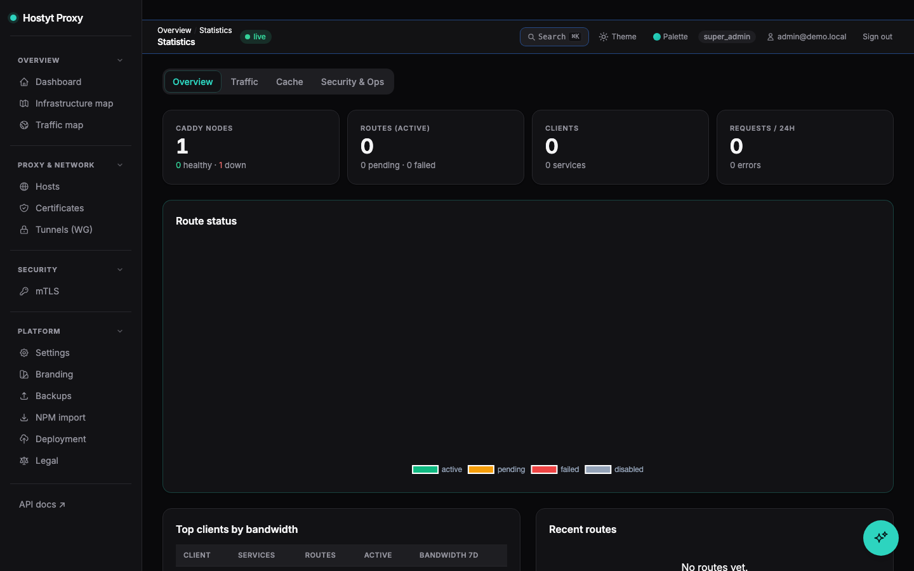
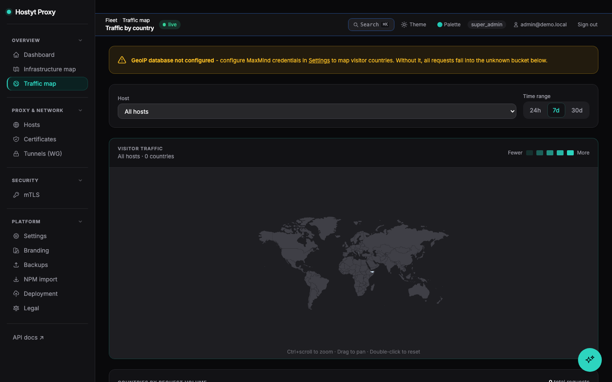
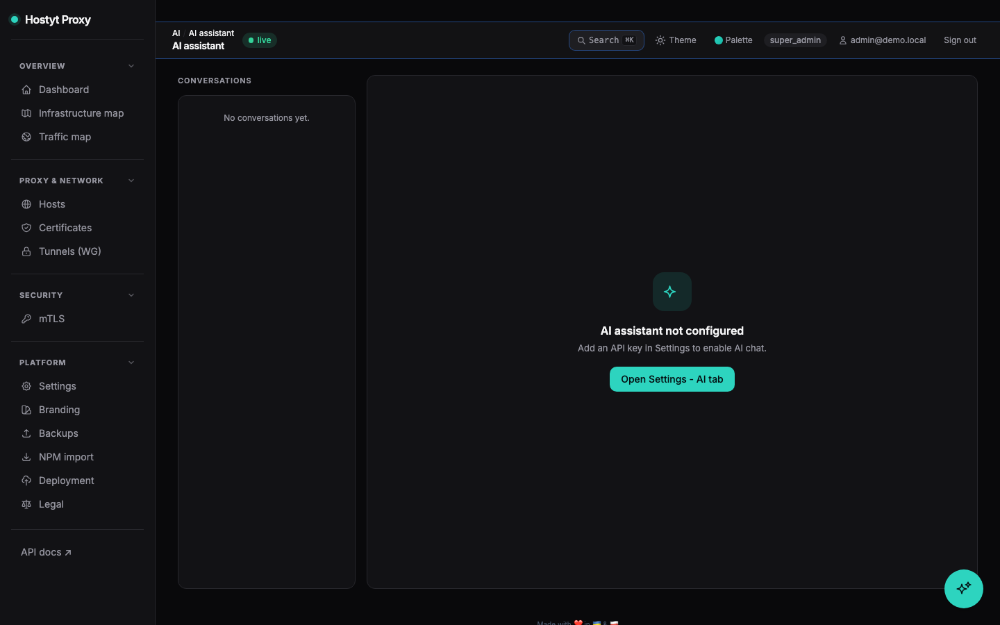
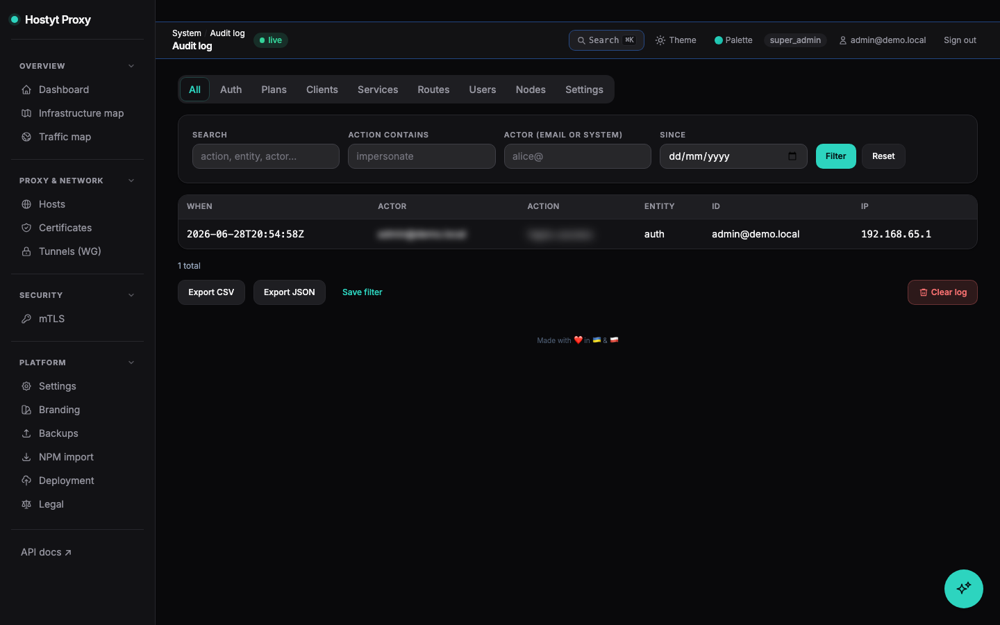

# Hostyt Proxy Gateway

Self-hosted control panel for a fleet of [Caddy](https://caddyserver.com)
reverse-proxy nodes. Customers get a VPS with a fixed backend IP and a
fixed range of public ports; they map their own domains to those ports
through the panel. The control plane configures every Caddy node over
WireGuard, drives Let's Encrypt issuance, and surfaces traffic stats.

**Status:** v1.0.0. Stack: Go 1.26.3, chi, MariaDB, Redis, Caddy 2.8.
Single binary ~21 MB image, ~28 MB idle RAM.

---

## Highlights

- **NPM-style operator surface**: `/admin/hosts` is a flat list of
  every domain across every client. **Add host** in one form (domain +
  backend IP:port + node) - the implied client/plan/service rows are
  provisioned automatically under your admin account.
- **Self-bootstrap panel route**: the install wizard pushes a virtual
  Caddy route for the public APP URL → app container on the first
  node, so you can sign in via `https://proxy.example.com` without
  adding a host first.
- **Two plan kinds**:
  - `restricted` (default) - admin pins backend IP + port range,
    client picks domain + port from the range. The hosting-provider
    model.
  - `npm` - full self-service: the client may edit backend IP + port
    range from `/app/services`. Use for resellers / your own accounts.
- **Auditable client impersonation**: super-admin opens `/admin/users`,
  clicks Impersonate, sees the client portal as them. Every action is
  audit-attributed to the admin with `impersonated_user_id` in meta;
  the impersonation banner is visible on every page. Back to admin
  via `/auth/end-impersonation`.
- **Bulk actions on hosts**: enable / disable / delete many rows from
  the flat list, with a single Caddy resync per affected node.
- **Inline DNS pre-check** on the Add-host form before submit.
- **Per-host retry** triggers a DNS re-check + Caddy re-push, which
  is the clean unblock when Let's Encrypt has been failing for a host
  whose DNS is already correct.
- **One-command node join** (Docker-Swarm style): operator generates a
  token in the panel; new VPS runs one `curl | sudo bash` line and is
  fully provisioned, including WireGuard mesh and Caddy.
- **WireGuard sidecar** on the manager auto-applies peer add/remove via
  `wg syncconf` - no manual interface restart on each join.
- **Caddy Admin API** driven in JSON mode, source of truth is the DB.
- **On-Demand TLS** with an `/internal/ask` allowlist gate; ACME
  certificates issued automatically when a domain points at the right
  node.
- **2FA**: TOTP (QR enrollment + recovery codes), Email OTP, SMS OTP,
  WebAuthn/passkeys (discoverable login). **OIDC** (Authentik / Microsoft /
  generic), OAuth2 social login (GitHub, Google). **Argon2id** passwords,
  **Redis-backed brute-force lockout** (10 / 15 min), **multi-provider
  CAPTCHA** (Turnstile / hCaptcha / reCAPTCHA v3), **AES-256-GCM**
  encryption for all secrets at rest.
- **REST API v1** with bearer-token auth for FOSSBilling / Hostyt-style
  provisioning integrations.
- **Live admin stats**: KPI cards, doughnut/line/bar charts, per-node
  traffic (Prometheus-scraped from Caddy).
- **Dark / light mode** UI with Inter font and a consistent design
  system.
- **Dark-ops console UI**: command palette (Cmd+K), collapsible nav groups, right-sheet drawer, teal design system.
- **AI assistant**: floating bubble, multi-provider (Anthropic / OpenAI / Gemini / OpenRouter), streaming SSE, scoped read-only tool-calling, per-user rate limit.
- **WAF (Coraza)**: per-route toggle, rule suppression, event acknowledgement, real-time events from node-agent.
- **GeoIP blocking**: country allow/deny, continent blocking, CIDR always-block/allow, configurable response code, fail-closed mode, world traffic map.
- **mTLS per route**: per-tenant CA, client cert issue/revoke, path-based RBAC, enforcement audit log.
- **L4 TCP/UDP streams**: SNI routing, configurable log retention.
- **Installation profiles**: homelab / smallteam / advanced / provider modes with guided wizard.
- **Instance sync**: master/slave HPG config replication for HA setups.
- **Multi-provider CAPTCHA**: Turnstile, hCaptcha, reCAPTCHA v3 per-settings toggle.
- **Custom fields**: operator-defined fields for clients and hosts (JSON-backed).
- **Advanced load balancing**: uri_hash, header, cookie (with HMAC secret) in addition to round-robin/least-conn.
- **Server-side search/pagination/sort** with saved filter presets across all list pages.
- **Host groups** with filter and badge support.
- **Hourly log rollups** (14-day retention) + analytics charts on host logs page.
- **Alert rules**: high-error-rate detection and custom threshold alerts.
- **Client self-registration** behind settings toggle.
- **Backup/restore**: S3/SFTP/FTP targets, restore drill CLI.

---

## Quick start (single host)

```bash
git clone https://github.com/host-yt/caddy-proxy-manager.git hostyt-proxy-gateway && cd hostyt-proxy-gateway
cp .env.example .env
$EDITOR .env       # at minimum: APP_URL, APP_SECRET (openssl rand -hex 32), DB_PASSWORD

docker compose -f deploy/docker-compose.yml --env-file .env up -d
open http://localhost:8080            # walks through the install wizard
```

After the wizard completes, sign in with the admin user you just
created.

For multi-node deployments enable the WireGuard sidecar profile:

```bash
docker compose -f deploy/docker-compose.yml --env-file .env --profile mesh up -d
```

Then in **Settings → WireGuard**, fill `Public endpoint`
(`manager.example.com:51820`), Save → keypair generated.

To add a remote Caddy node:

1. **Admin → Caddy nodes → Auto-join → Generate join command** -
   shows a one-time `curl … | sudo bash …` line (TTL 30 min).
2. Paste it on the new VPS as root. It installs WireGuard, Docker,
   Caddy, joins the mesh, and registers itself.

Full guide: [docs/MULTI_NODE.md](docs/MULTI_NODE.md).

---

## Repository map

```
cmd/server/         entrypoint (thin)
internal/
  accesslog/        access log ingest, rollups, country/ASN enrichment
  adminscope/       non-super-admin client scope enforcement
  ai/               multi-provider AI client (Anthropic, OpenAI, Gemini, OpenRouter)
  aichat/           chat session storage and SSE streaming handler
  aitools/          scoped read-only DB tool-calling for AI assistant
  alert/            alert rule evaluation and notification dispatch
  audit/            audit-log writer (actor, IP, impersonator, timestamp)
  auth/             Argon2id, sessions, TOTP, Email/SMS OTP, WebAuthn, API keys, password reset
  backup/           S3/SFTP/FTP backup targets and restore drill
  caddyapi/         Caddy Admin API client + JSON config builder
  captcha/          multi-provider CAPTCHA verifier (Turnstile / hCaptcha / reCAPTCHA v3)
  chatstore/        AI conversation persistence
  cloudflare/       Cloudflare API token + CF-Connecting-IP trust toggle
  config/           env loader + validation
  customfields/     operator-defined metadata fields for clients and hosts
  deployment/       installation profiles (homelab / smallteam / advanced / provider)
  dns/              pre-flight DNS resolver + per-route resolver controls
  domain/           business logic per aggregate (routes, plans, services, nodes, …)
  geoip/            MaxMind GeoLite2-Country DB download and distribution to nodes
  httpserver/       chi router, handlers, middleware (CSRF, CSP, security headers, etc.)
  installstate/     wizard state file + AES-256-GCM crypto helpers
  instasync/        master/slave HPG config replication
  jobs/             background scheduler (key rotation, rollup, geoip update, …)
  mail/             SMTP send + email templates
  metrics/          Caddy /metrics Prometheus scraper + delta aggregator
  mtls/             per-tenant CA management, cert issue/revoke, RBAC verifier
  nodejoin/         one-time join-token mint + redeem
  oauth2x/          OAuth2 social login (GitHub, Google)
  oidc/             coreos/go-oidc wrapper, DB-backed config
  security/         scoped security checks shared across handlers
  store/            DB pool + goose migration runner
  systemevents/     operational event history storage
  view/             html/template sets per audience (install, auth, admin, app)
  wafevents/        WAF audit log ingest and event storage
  webhook/          outbound webhook delivery and retry
  wireguard/        Curve25519 keypair gen, config writer, IP allocator
node-agent/         Go agent on each Caddy node (WG sync, log forward, WAF events, GeoIP)
deploy/
  docker-compose.yml    manager stack (app + mariadb + redis + caddy + node-agent + optional wg)
  caddy/                Caddy node image (xcaddy with cache-handler + L4 modules)
  remote-node/          drop-in compose for an external Caddy node
  wireguard/            WG sidecar image (alpine + wg-tools + watch loop)
migrations/             117 goose .sql files (auto-applied on boot)
scripts/                node-join.sh - bash bootstrap for remote nodes
docs/                   all the docs you'll find linked below
```

---

## Screenshots

| Install wizard | Admin dashboard |
|---|---|
|  |  |

| Host list | New host form |
|---|---|
|  |  |

| Stats | World map |
|---|---|
|  |  |

| AI assistant | Audit log |
|---|---|
|  |  |

Full install wizard walkthrough: [`docs/install_video/install_wizard.webm`](docs/install_video/install_wizard.webm)

---

## Documentation

| Doc | What's in it |
| --- | ------------ |
| [`docs/INSTALL.md`](docs/INSTALL.md) | Step-by-step first-deploy |
| [`docs/DEPLOY.md`](docs/DEPLOY.md) | Production deploy + Portainer + reverse-proxy tips |
| [`docs/MULTI_NODE.md`](docs/MULTI_NODE.md) | WireGuard mesh + one-command node join |
| [`docs/ARCHITECTURE.md`](docs/ARCHITECTURE.md) | How the pieces talk |
| [`docs/API.md`](docs/API.md) | REST API v1 contract |
| [`docs/SPEC.md`](docs/SPEC.md) | Functional specification |
| [`docs/SECURITY.md`](docs/SECURITY.md) | Threat model and security model |
| [`docs/WAF.md`](docs/WAF.md) | Web Application Firewall (Coraza) |
| [`docs/GEOIP.md`](docs/GEOIP.md) | GeoIP country filtering |
| [`docs/DNS_PROVIDERS.md`](docs/DNS_PROVIDERS.md) | DNS-01 challenge providers for wildcard TLS |
| [`docs/MTLS.md`](docs/MTLS.md) | Mutual TLS / client certificate auth |
| [`docs/ANALYTICS.md`](docs/ANALYTICS.md) | Access log analytics |
| [`docs/ROADMAP.md`](docs/ROADMAP.md) | Shipped features and planned work |
| [`docs/FEATURE_MATRIX.md`](docs/FEATURE_MATRIX.md) | HPG vs alternatives comparison |
| [`docs/TROUBLESHOOTING.md`](docs/TROUBLESHOOTING.md) | Common issues + fixes |
| [`CHANGELOG.md`](CHANGELOG.md) | Notable changes |
| [`CONTRIBUTING.md`](CONTRIBUTING.md) | How to develop / submit changes |
| [`SECURITY.md`](SECURITY.md) | Reporting vulnerabilities |

---

## License

See [LICENSE](LICENSE). For open-sourcing guidance see
[`docs/OPENSOURCING.md`](docs/OPENSOURCING.md).
